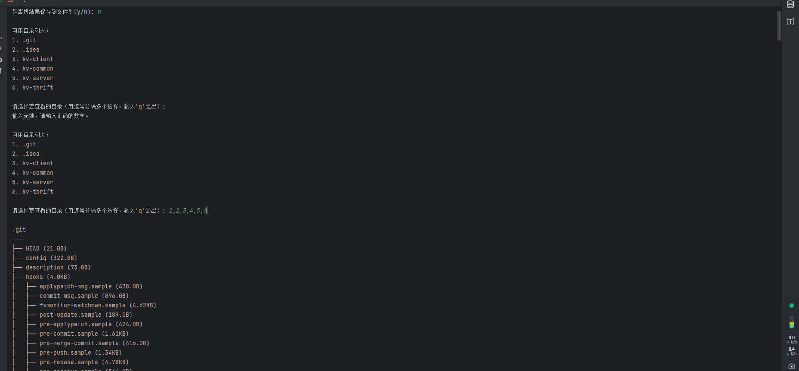

# 目录树生成脚本 README

## 概述

这是一个用于在命令行中以树状结构显示指定文件夹内容的 Python 脚本。它提供了多种功能，包括：

- **显示文件和文件夹的树状结构**
- **显示文件大小**
- **支持文件类型过滤**
- **可设置最大递归深度**
- **可选择是否包含隐藏文件**
- **支持将输出结果保存到文件**

此脚本适用于需要快速查看目录结构、文件大小和组织文件系统的用户。

## 功能特性

- **树状结构显示**：以易于阅读的树状结构显示指定目录下的所有文件和子目录。
- **文件大小显示**：在每个文件和文件夹后显示其大小，单位自适应（B、KB、MB、GB、TB）。
- **文件类型过滤**：支持按文件扩展名过滤显示指定类型的文件。
- **递归深度控制**：可设置最大递归深度，限制树状结构的层级。
- **隐藏文件选项**：可选择是否包含隐藏文件和文件夹（以`.`开头的文件）。
- **输出保存**：支持将结果保存到指定的文本文件中，方便后续查看或分享。

## 环境依赖

- **Python 版本**：3.x
- **操作系统**：Windows、macOS 或 Linux

## 使用方法

### 1. 运行脚本

确保已安装 Python 3.x，并将脚本保存为 `directory_tree.py`。在命令行中运行：

```bash
python directory_tree.py
```

### 2. 输入起始文件夹路径

程序启动后，会提示输入要显示的起始文件夹路径：

```
请输入起始文件夹路径:
```

示例输入：

```
请输入起始文件夹路径: /Users/yourusername/Documents
```

### 3. 设置选项

根据提示，按需配置以下选项：

- **是否包含隐藏文件**：

  ```
  是否包含隐藏文件？(y/n):
  ```

  输入 `y` 或 `n`。

- **文件类型过滤器**：

  ```
  请输入要过滤的文件类型（例如 '.txt'，直接回车表示不过滤）:
  ```

  示例输入 `.py` 只显示 `.py` 文件，直接按回车则不过滤。

- **最大递归深度**：

  ```
  请输入最大递归深度（直接回车表示不限制）:
  ```

  输入数字限制递归深度，直接按回车表示不限制。

- **是否将结果保存到文件**：

  ```
  是否将结果保存到文件？(y/n):
  ```

  输入 `y` 或 `n`。

  - 如果选择 `y`，将提示输入输出文件的路径：

    ```
    请输入输出文件的路径:
    ```

### 4. 选择要查看的目录

程序会列出起始文件夹下的所有子目录：

```
可用目录列表：
1. Folder1
2. Folder2
3. Folder3
```

输入要查看的目录编号，支持多个选择，用逗号分隔：

```
请选择要查看的目录（用逗号分隔多个选择，输入'q'退出）:
```

示例输入：

```
1,3
```

### 5. 查看输出结果

程序将显示选定目录的树状结构。例如：

```
Folder1
-------
├── file1.txt (2KB)
└── Subfolder (4KB)
    ├── file2.py (1KB)
    └── file3.md (3KB)

Folder3
-------
└── image.png (5KB)
```

如果选择了保存到文件，结果也会被写入指定的输出文件中。

### 6. 继续操作或退出

可以继续选择其他目录查看，或输入 `q` 退出程序：

```
请选择要查看的目录（用逗号分隔多个选择，输入'q'退出）: q
程序已退出。
```

## 注意事项

- **权限问题**：如果遇到权限不足导致无法访问某些文件或文件夹，程序会在输出中标记 `[Permission Denied]`。
- **文件大小获取失败**：如果无法获取文件大小，会显示为 `Unknown`。
- **路径有效性**：确保输入的起始文件夹路径存在且为有效的目录。

## 示例

假设您的文件夹结构如下：

```
/Users/yourusername/Documents
├── Project
│   ├── main.py
│   ├── utils.py
│   └── README.md
├── Notes
│   ├── notes.txt
│   └── ideas.md
└── .hidden_folder
    └── secret.txt
```

按照以下步骤运行脚本：

1. **启动脚本**

   ```bash
   python directory_tree.py
   ```

2. **输入起始文件夹路径**

   ```
   请输入起始文件夹路径: /Users/yourusername/Documents
   ```

3. **设置选项**

   ```
   是否包含隐藏文件？(y/n): n
   请输入要过滤的文件类型（例如 '.txt'，直接回车表示不过滤）: .py
   请输入最大递归深度（直接回车表示不限制）: 2
   是否将结果保存到文件？(y/n): y
   请输入输出文件的路径: /Users/yourusername/Desktop/output.txt
   ```

4. **选择目录**

   ```
   可用目录列表：
   1. Project
   2. Notes

   请选择要查看的目录（用逗号分隔多个选择，输入'q'退出）: 1
   ```

5. **查看输出**

   ```
   Project
   -------
   ├── main.py (3KB)
   └── utils.py (2KB)
   ```

   输出结果也被保存到了 `/Users/yourusername/Desktop/output.txt`。

## 常见问题

**Q**：为什么有些文件或文件夹没有显示？

**A**：可能是由于权限不足、被文件类型过滤器过滤，或未选择包含隐藏文件。

**Q**：如何查看隐藏文件和文件夹？

**A**：在设置选项时，选择包含隐藏文件（输入 `y`）。

**Q**：文件大小显示为 `Unknown` 是什么原因？

**A**：可能是由于无法获取文件大小，可能是权限问题或文件已被删除。

